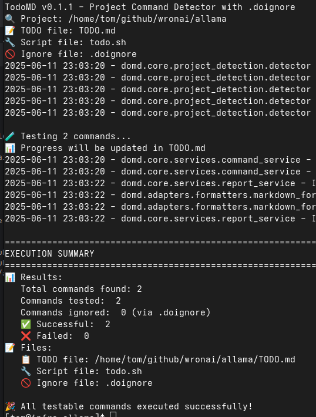

# ✓ DoMD - Project Command Detector

[](https://opensource.org/licenses/Apache-2.0)
[](https://www.python.org/downloads/)
[](https://github.com/psf/black)
[](https://github.com/wronai/domd/actions)
[](https://www.docker.com/)
[](https://wronai.github.io/domd/)

**DoMD** (Do Markdown Docs) is a powerful tool for automatically detecting, executing, and managing commands in development projects. It helps you maintain your project's documentation by generating and updating `todo.md` and `done.md` files based on command execution results.

> 💡 **Pro Tip**: When you think everything in your project is working correctly, run `domd` to verify all commands and update your documentation!

## ✨ Key Features

- **Automatic Command Detection** - Discovers commands from various project files
- **Docker Integration** - Run commands in isolated containers
- **Smart Command Filtering** - Skip specific commands using `.doingore`
- **Cross-Platform** - Works on Linux, macOS, and Windows
- **Extensible** - Add support for new command types and tools

## 🚀 Quick Start

### Installation & Basic Usage

1. **Install DoMD** (choose one method):

   ```bash
   # Using pip (recommended)
   pip install domd

   # Or using Docker
   docker run -v $(pwd):/app ghcr.io/wronai/domd domd
   ```

2. **Run DoMD** in your project directory:
   ```bash
   # Simply run 'domd' to get started!
   domd
   ```

   That's it! DoMD will automatically:
   - Scan your project for available commands
   - Run and test the commands
   - Generate a report of the results
   - Create a TODO.md with any issues found



### Common Commands

- List available commands:
  ```bash
  domd --list
  ```

- Run a specific command:
  ```bash
  domd run test
  ```

- Generate a report:
  ```bash
  domd report
  ```

## 📖 Documentation

For detailed documentation, please visit our [documentation site](https://wronai.github.io/domd/) or check the [docs](./docs) directory.

- [Installation Guide](./docs/installation.md)
- [Usage Guide](./docs/usage.md)
- [Docker Integration](./docs/docker.md)
- [Advanced Configuration](./docs/features/core.md)
- [API Reference](./docs/api.md)

## 🤝 Contributing

Contributions are welcome! Please read our [Contributing Guide](CONTRIBUTING.md) for details on how to get started.

## 📄 License

This project is licensed under the Apache 2.0 License - see the [LICENSE](LICENSE) file for details.

## 💡 Need Help?

Open an [issue](https://github.com/wronai/domd/issues) if you need help or have questions.
- Patterns support glob-style wildcards (`*` matches any sequence of characters)
- Matches are case-insensitive

### 🐳 Running Commands in Docker with `.dodocker`

For better isolation and consistency, you can specify commands that should be executed inside a Docker container using a `.dodocker` file.

#### `.dodocker` File Format

```
# Commands to run in Docker container
pytest
black --check .
flake8
mypy .
```

#### How It Works
- Each line specifies a command that should be run in a Docker container
- Commands are executed in the `python:3.9` container by default
- The project directory is mounted to `/app` in the container
- The working directory is set to `/app`
- The container is automatically removed after execution

#### Customizing Docker Configuration

You can customize the Docker configuration by creating a `Dockerfile` in your project root. For example:

```dockerfile
FROM python:3.9

# Install additional dependencies
RUN apt-get update && apt-get install -y \
    gcc \
    libpq-dev \
    && rm -rf /var/lib/apt/lists/*

# Install Python dependencies
COPY pyproject.toml poetry.lock ./
RUN pip install poetry && \
    poetry config virtualenvs.create false && \
    poetry install --no-interaction --no-ansi
```

DoMD will automatically detect and use this `Dockerfile` when running commands in a container.

## 🤖 Programmatic Usage

```python
from domd import ProjectCommandDetector

# Initialize detector
detector = ProjectCommandDetector(
    project_path="./my-project",
    timeout=60,
    exclude_patterns=["*.pyc", "__pycache__/*"]
)

# Scan for commands
commands = detector.scan_project()
print(f"Found {len(commands)} commands")

# Test commands
detector.test_commands(commands)

# Generate report
detector.generate_output_file("RESULTS.md", "markdown")

# Access results
failed_commands = detector.failed_commands
success_rate = (len(commands) - len(failed_commands)) / len(commands) * 100
print(f"Success rate: {success_rate:.1f}%")
```

## 🧪 Development

### Setup Development Environment
```bash
git clone https://github.com/wronai/domd.git
cd domd
poetry install --with dev,docs,testing

# Install pre-commit hooks
poetry run pre-commit install
```

### Running Tests
```bash
# Run all tests
poetry run pytest

# Run with coverage
poetry run pytest --cov=domd --cov-report=html

# Run specific test categories
poetry run pytest -m "unit"
poetry run pytest -m "integration"
```

### Code Quality
```bash
# Format code
poetry run black src/ tests/
poetry run isort src/ tests/

# Linting
poetry run flake8 src/ tests/
poetry run mypy src/

# All quality checks
make lint
```

### Building Documentation
```bash
# Serve locally
poetry run mkdocs serve

# Build static site
poetry run mkdocs build
```

## 🤝 Contributing

Contributions are welcome! Please feel free to submit a Pull Request. For major changes, please open an issue first to discuss what you would like to change.

### Adding New Parsers

To add support for a new project type:

1. Create a parser in `src/domd/parsers/`
2. Implement the parser interface
3. Add tests in `tests/parsers/`
4. Update documentation

Example parser structure:
```python
from .base import BaseParser

class NewProjectParser(BaseParser):
    def can_parse(self, file_path: Path) -> bool:
        return file_path.name == "config.yaml"

    def parse_commands(self, file_path: Path) -> List[Dict]:
        # Implementation here
        pass
```

## 📄 License

This project is licensed under the Apache License 2.0 - see the [LICENSE](LICENSE) file for details.

## 🙏 Acknowledgments

- Inspired by the need for automated project health monitoring
- Built with [Poetry](https://python-poetry.org/) for dependency management
- Uses [pytest](https://pytest.org/) for testing framework
- Documentation powered by [MkDocs](https://www.mkdocs.org/)

## 📊 Project Stats

- **Languages Supported**: 10+
- **File Types Detected**: 20+
- **Command Types**: 50+
- **Python Versions**: 3.8+

## 🔗 Links

- [Documentation](https://domd.readthedocs.io)
- [PyPI Package](https://pypi.org/project/domd/)
- [GitHub Repository](https://github.com/wronai/domd)
- [Issue Tracker](https://github.com/wronai/domd/issues)
- [Changelog](https://github.com/wronai/domd/blob/main/CHANGELOG.md)

## 💡 Use Cases

- **Pre-deployment Checks**: Verify all project commands work before deployment
- **CI/CD Integration**: Add as a quality gate in your pipeline
- **Onboarding**: Help new developers identify setup issues
- **Project Maintenance**: Regular health checks for legacy projects
- **Documentation**: Generate comprehensive command documentation

## ⚡ Quick Examples

### CI/CD Integration (GitHub Actions)
```yaml
name: Project Health Check
on: [push, pull_request]

jobs:
  health-check:
    runs-on: ubuntu-latest
    steps:
    - uses: actions/checkout@v3
    - name: Setup Python
      uses: actions/setup-python@v4
      with:
        python-version: '3.9'
    - name: Install DoMD
      run: pip install domd
    - name: Run Project Health Check
      run: domd --verbose
    - name: Upload TODO.md if failures
      if: failure()
      uses: actions/upload-artifact@v3
      with:
        name: failed-commands
        path: TODO.md
```

### Make Integration
```makefile
.PHONY: health-check
health-check:
	@echo "Running project health check..."
	@domd --quiet || (echo "❌ Some commands failed. Check TODO.md" && exit 1)
	@echo "✅ All project commands working!"

.PHONY: health-report
health-report:
	@domd --dry-run --verbose
```

### Pre-commit Hook
```yaml
# .pre-commit-config.yaml
repos:
  - repo: local
    hooks:
      - id: domd-check
        name: Project Command Health Check
        entry: domd
        language: system
        pass_filenames: false
        always_run: true
```
