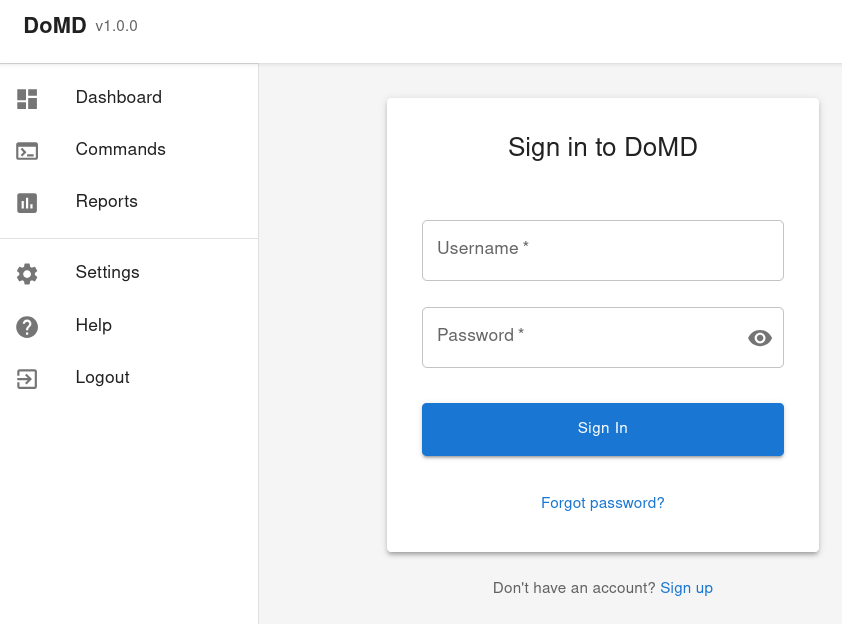

# ✓ DoMD - Do Markdown Docs

[](https://opensource.org/licenses/Apache-2.0)
[](https://www.python.org/downloads/)
[](https://github.com/psf/black)
[](https://github.com/wronai/domd/actions)
[![Docker Support][docker-badge]][docker-url]
[![Documentation][docs-badge]][docs-url]

**DoMD** (Do Markdown Docs) is a powerful tool that helps you maintain up-to-date project documentation by automatically detecting, running, and documenting commands from your project files. It generates and updates `TODO.md` and `DONE.md` files based on command execution results, making it easier to track what works and what needs attention.

```bash
# Start DoMD analyzer
domd
```

## Web Interface

DoMD comes with a modern web interface that allows you to interact with your project's commands through a user-friendly dashboard.

### Starting the Web Interface

```bash
# Start the web interface on default port (3000)
domd web

# Specify a custom port
domd web --port 8088

# Start without automatically opening a browser
domd web --no-browser
```

### Web Interface Features

- **Command Management**: View, run, and manage all your project commands from one place
- **Real-time Output**: See command execution results in real-time
- **History Tracking**: Keep track of command execution history
- **Responsive Design**: Works on both desktop and mobile devices
- **Dark Mode**: Built-in dark theme for comfortable viewing

### Requirements

- Node.js 16+ and npm 8+
- Python 3.9+
- Modern web browser (Chrome, Firefox, Safari, or Edge)

### Web Interface Setup

1. Start the web interface:

   ```bash
   domd web --port 8088
   ```

2. Open your browser and navigate to [http://localhost:8088](http://localhost:8088)

3. The interface will automatically detect and display your project's commands

### Development Mode

For development, you can run the frontend and backend separately:

```bash
# Terminal 1 - Start the backend API
cd backend
python -m domd.api

# Terminal 2 - Start the frontend development server
cd frontend
npm start
```

## ✨ Core Features

- **Automatic Command Detection** - Discovers and extracts commands from various project files
- **Smart Execution** - Runs commands and captures their output and status
- **Docker Integration** - Execute commands in isolated containers for consistency
- **Command Testing** - Validate and test commands in Docker containers
- **Smart .doignore Management** - Automatically update ignore patterns based on test results
- **Comprehensive Reporting** - Generates detailed reports in markdown format
- **Customizable** - Configure includes, excludes, and command behavior
- **Cross-Platform** - Works on Linux, macOS, and Windows
- **Extensible** - Add support for new command types and tools
- **REST API** - Full programmatic access to all features

## Demo

[](https://www.youtube.com/watch?v=YOUR_VIDEO_ID)

## Examples

Explore our comprehensive collection of examples to get started with DoMD:

- [Basic Examples](docs/examples/basic/) - Simple examples to get you started
- [Advanced Usage](docs/examples/advanced/) - Complex scenarios and custom configurations
- [Web Interface Guide](docs/examples/web/) - How to use the DoMD web interface
- [CI/CD Integration](docs/examples/ci_cd/) - Automate documentation with GitHub Actions and more
- [Integration Examples](docs/examples/integration/) - Using DoMD with other tools and platforms



## Command Testing

DoMD includes powerful command testing capabilities that help you validate and test shell commands in isolated Docker containers:

```bash
# Test individual commands
domd test-commands "ls -la" "pwd" "echo Hello"

# Test commands from a file and update .doignore
domd test-commands --update-doignore -f commands.txt

# Skip Docker testing (only validate commands)
domd test-commands --no-docker -f commands.txt
```

### Testing Features

- **Command Validation**: Automatically detect valid shell commands vs documentation
- **Docker Testing**: Test commands in isolated containers
- **Automatic .doignore Updates**: Update ignore patterns based on test results
- **REST API**: Full programmatic access to testing features

For more details, see the [Command Testing Documentation](docs/command_testing.md).

## Quick Start

### Prerequisites

- Python 3.8 or newer
- pip (Python package manager)
- (Optional) Docker for containerized execution

### Installation

Choose the installation method that works best for you:

```bash
1. **Install DoMD** (if not already installed):

   ```bash
   pip install domd
   ```

   Or using Docker (no installation required):

   ```bash
   docker run --rm -v $(pwd):/app ghcr.io/wronai/domd domd
   ```

## Basic Usage

1. **Navigate to your project directory**:

   ```bash
   cd /path/to/your/project
   ```

2. **Run DoMD**:

   ```bash
   # Basic scan
   domd
   ```

   Or use the web interface:

   ```bash
   domd web
   ```

## Web Interface Overview

DoMD includes a secure web-based interface for a more interactive experience:

### Web Interface Setup

```bash
# Start the web interface (default port: 3003)
domd web

# Specify a custom port
domd web --port 8088

# Start without opening browser automatically
domd web --no-browser

# Start with specific host binding
domd web --host 0.0.0.0
```

   DoMD will:
   - Scan your project for available commands
   - Execute the commands in the correct context
   - Generate a report in `TODO.md` with any issues found
   - Update `DONE.md` with successfully executed commands

### Common Commands

- List available commands without executing them:
  ```bash
  domd --list
  ```

- Run a specific command by name or pattern:
  ```bash
  domd run test
  domd run "test*"
  ```

- Generate a report without executing commands:
  ```bash
  domd --dry-run
  ```

- Get help with available options:
  ```bash
  domd --help
  ```

> Pro Tip: Run `domd` regularly to keep your project documentation in sync with your actual project state!

## Web Interface

DoMD comes with a web-based interface for a more interactive experience. Here's how to get it running:

### Development Prerequisites

- Node.js (v14 or later)
- npm (comes with Node.js) or Yarn

### Running the Development Server

1. Navigate to the frontend directory:

   ```bash
   cd frontend
   ```

2. Install dependencies:

   ```bash
   npm install
   # or if you use Yarn:
   # yarn
   ```

3. Start the development server:

   ```bash
   npm start
   # or if you use Yarn:
   # yarn start
   ```

4. Open your browser and visit [http://localhost:3003](http://localhost:3003)

### Building for Production

To create a production build:

```bash
cd frontend
npm run build
# or with Yarn:
# yarn build
```

This will create an optimized production build in the `build` directory.

## Documentation

For detailed documentation, please visit our [documentation site](https://wronai.github.io/domd/) or check the [docs](./docs) directory.

- [Installation Guide](./docs/installation.md)
- [Usage Guide](./docs/usage.md)
- [Docker Integration](./docs/docker.md)
- [Advanced Configuration](./docs/features/core.md)
- [API Reference](./docs/api.md)

## Contributing

Contributions are welcome! Please read our [Contributing Guide][contributing] for details on how to get started.

## License

This project is licensed under the Apache 2.0 License - see the [LICENSE](LICENSE) file for details.

## Need Help?

Open an [issue][issues] if you need help or have questions.

[contributing]: https://github.com/wronai/domd/blob/main/CONTRIBUTING.md
[issues]: https://github.com/wronai/domd/issues

## Pattern Matching

- Patterns support glob-style wildcards (`*` matches any sequence of characters)
- Matches are case-insensitive

### Subdirectory README.md Support

DoMD can automatically scan first-level subdirectories for additional `README.md` files and execute commands found within them. This is particularly useful for monorepos or projects with multiple components.

### Local Development

For local development, you can start both the backend and frontend services:

```bash
# Start the backend server
poetry run uvicorn domd.main:app --reload --port 8008

# In a separate terminal, start the frontend
cd frontend
npm install
npm start
```

### Authentication and Login

The web interface is protected by authentication. Use the following default credentials:

- URL: [http://localhost:3000](http://localhost:3000) (frontend development server) or [http://localhost:3003](http://localhost:3003) (production build)
- Username: admin
- Password: admin123
- **URL**: [http://localhost:3000](http://localhost:3000) (frontend development server) or [http://localhost:3003](http://localhost:3003) (production build)
- **Username**: admin
- **Password**: admin123

> **Security Note**
>
> Change the default password after first login by navigating to User Settings in the web interface.

#### First-Time Login

1. Open your web browser and navigate to http://localhost:3000 (development) or http://localhost:3003 (production)
2. Enter the default credentials:
   - Email/Username: `admin`
   - Password: `admin123`
3. Click "Sign In"
4. Immediately change your password in the User Settings menu

### Web Interface Features

- **Secure Login**: Protected by username/password authentication
- **Interactive Dashboard**: View command execution results in real-time
- **Command History**: Browse through previously executed commands
- **Filtering**: Filter commands by status, type, or search term
- **Detailed Views**: See full command output and execution details
- **User Management**: Manage users and permissions (admin only)
- **Responsive Design**: Works on desktop and mobile devices

### Troubleshooting Login Issues

If you're having trouble logging in:

1. Ensure the backend server is running (check terminal for errors)
2. Verify the frontend is properly connected to the backend (check browser's developer console for errors)
3. Clear your browser cache and cookies if experiencing persistent login issues
4. Check that your credentials are correct (default: admin/admin123)
5. If you've forgotten your password, you can reset it by:
   - Stopping the server
   - Deleting the `domd.db` file (or your configured database file)
   - Restarting the server (this will recreate the database with default credentials)

Then:

1. Open http://localhost:3003 in your browser
2. Log in with the default credentials
3. Navigate to Settings > Users to change the default password
4. (Optional) Create additional users with appropriate permissions

### Prerequisites

To use the web interface, you'll need:

- Node.js (v16 or later) and npm (v8 or later)
- Python 3.8+ with DoMD installed
- Internet connection (for loading external resources)
- Modern web browser (Chrome, Firefox, Safari, or Edge)

## Basic Command Line Usage

1. Navigate to your project directory:

   ```bash
   cd /path/to/your/project
   ```

2. Run DoMD with the web interface:

   ```bash
   # Start the web server
   domd web

   # The interface will be available at http://localhost:3003 by default
   ```

3. Open your browser and navigate to the displayed URL

## Advanced Command Line Usage

For command-line usage, you can run:

```bash
domd
```

   DoMD will:
   - Scan your project for available commands
   - Execute the commands in the correct context
   - Generate a report in `TODO.md` with any issues found
   - Update `DONE.md` with successfully executed commands

### Common Commands

- **List available commands** without executing them:
  ```bash
  domd --list
  ```

- **Run a specific command** by name or pattern:
  ```bash
  domd run test
  domd run "test*"
  ```

- **Generate a report** without executing commands:
  ```bash
  domd --dry-run
  ```

- **Get help** with available options:
  ```bash
  domd --help
  ```

> 💡 **Pro Tip**: Run `domd` regularly to keep your project documentation in sync with your actual project state!

## 🌐 Web Interface

DoMD comes with a web-based interface for a more interactive experience. Here's how to get it running:

### Development Prerequisites

- Node.js (v14 or later)
- npm (comes with Node.js) or Yarn

### Running the Development Server

1. Navigate to the frontend directory:

   ```bash
   cd frontend
   ```

2. Install dependencies:

   ```bash
   npm install
   # or if you use Yarn:
   # yarn
   ```

3. Start the development server:

   ```bash
   npm start
   # or if you use Yarn:
   # yarn start
   ```

4. Open your browser and visit [http://localhost:3003](http://localhost:3003)

### Building for Production

To create a production build:

```bash
cd frontend
npm run build
# or with Yarn:
# yarn build
```

This will create an optimized production build in the `build` directory.

## 📖 Documentation

For detailed documentation, please visit our [documentation site](https://wronai.github.io/domd/) or check the [docs](./docs) directory.

- [Installation Guide](./docs/installation.md)
- [Usage Guide](./docs/usage.md)
- [Docker Integration](./docs/docker.md)
- [Advanced Configuration](./docs/features/core.md)
- [API Reference](./docs/api.md)

## 🤝 Contributing

Contributions are welcome! Please read our [Contributing Guide][contributing] for details on how to get started.

## 📄 License

This project is licensed under the Apache 2.0 License - see the [LICENSE](LICENSE) file for details.

## 💡 Need Help?

Open an [issue][issues] if you need help or have questions.

[contributing]: https://github.com/wronai/domd/blob/main/CONTRIBUTING.md
[issues]: https://github.com/wronai/domd/issues

## Pattern Matching

- Patterns support glob-style wildcards (`*` matches any sequence of characters)
- Matches are case-insensitive

### 📂 Subdirectory README.md Support

DoMD can automatically scan first-level subdirectories for additional `README.md` files and execute commands found within them. This is particularly useful for monorepos or projects with multiple components.

#### How It Works

- DoMD scans all first-level subdirectories in your project
- For each subdirectory containing a `README.md` file:
  - Commands are extracted from the `README.md`
  - Commands are executed with the subdirectory as the working directory
  - Command output and results are included in the main report

#### Example Project Structure

```text
my-project/
├── README.md           # Commands run from project root
├── frontend/
│   └── README.md      # Commands run from frontend/
├── backend/
│   └── README.md      # Commands run from backend/
└── docs/
    └── README.md      # Commands run from docs/
```

#### Benefits

- Keep commands close to the code they relate to
- Maintain separate command sets for different project components
- Simplify complex project automation
- Commands run in their proper context

### 🐳 Running Commands in Docker with `.dodocker`

For better isolation and consistency, you can specify commands that should be executed inside a Docker container using a `.dodocker` file.

#### `.dodocker` File Format

```
# Commands to run in Docker container
pytest
black --check .
flake8
mypy .
```

#### How It Works
- Each line specifies a command that should be run in a Docker container
- Commands are executed in the `python:3.9` container by default
- The project directory is mounted to `/app` in the container
- The working directory is set to `/app`
- The container is automatically removed after execution

#### Customizing Docker Configuration

You can customize the Docker configuration by creating a `Dockerfile` in your project root. For example:

```dockerfile
FROM python:3.9

# Install additional dependencies
RUN apt-get update && apt-get install -y \
    gcc \
    libpq-dev \
    && rm -rf /var/lib/apt/lists/*

# Install Python dependencies
COPY pyproject.toml poetry.lock ./
RUN pip install poetry && \
    poetry config virtualenvs.create false && \
    poetry install --no-interaction --no-ansi
```

DoMD will automatically detect and use this `Dockerfile` when running commands in a container.

## 🤖 Programmatic Usage

```python
from domd import ProjectCommandDetector

# Initialize detector
detector = ProjectCommandDetector(
    project_path="./my-project",
    timeout=60,
    exclude_patterns=["*.pyc", "__pycache__/*"]
)

# Scan for commands
commands = detector.scan_project()
print(f"Found {len(commands)} commands")

# Test commands
detector.test_commands(commands)

# Generate report
detector.generate_output_file("RESULTS.md", "markdown")

# Access results
failed_commands = detector.failed_commands
success_rate = (len(commands) - len(failed_commands)) / len(commands) * 100
print(f"Success rate: {success_rate:.1f}%")
```

## 🧪 Development

### Setup Development Environment
```bash
git clone https://github.com/wronai/domd.git
cd domd
poetry install --with dev,docs,testing

# Install pre-commit hooks
poetry run pre-commit install
```

### Running Tests
```bash
# Run all tests
poetry run pytest

# Run with coverage
poetry run pytest --cov=domd --cov-report=html

# Run specific test categories
poetry run pytest -m "unit"
poetry run pytest -m "integration"
```

### Code Quality
```bash
# Format code
poetry run black src/ tests/
poetry run isort src/ tests/

# Linting
poetry run flake8 src/ tests/
poetry run mypy src/

# All quality checks
make lint
```

### Building Documentation
```bash
# Serve locally
poetry run mkdocs serve

# Build static site
poetry run mkdocs build
```

## 🤝 Contributing

Contributions are welcome! Please feel free to submit a Pull Request. For major changes, please open an issue first to discuss what you would like to change.

## Adding New Parsers

To add support for a new project type, follow these steps:

1. Create a parser in `src/domd/parsers/`
2. Implement the parser interface
3. Add tests in `tests/parsers/`
4. Update documentation

Example parser structure:
```python
from .base import BaseParser

class NewProjectParser(BaseParser):
    def can_parse(self, file_path: Path) -> bool:
        return file_path.name == "config.yaml"

    def parse_commands(self, file_path: Path) -> List[Dict]:
        # Implementation here
        pass
```

## 📄 License

This project is licensed under the Apache License 2.0 - see the [LICENSE](LICENSE) file for details.

## 🙏 Acknowledgments

- Inspired by the need for automated project health monitoring
- Built with [Poetry](https://python-poetry.org/) for dependency management
- Uses [pytest](https://pytest.org/) for testing framework
- Documentation powered by [MkDocs](https://www.mkdocs.org/)

## 📊 Project Stats

- **Languages Supported**: 10+
- **File Types Detected**: 20+
- **Command Types**: 50+
- **Python Versions**: 3.8+

## 🔗 Links

- [Documentation][docs]
- [PyPI Package][pypi]
- [GitHub Repository][github]
- [Issue Tracker][issues]
- [Changelog][changelog]

[docs]: https://domd.readthedocs.io
[pypi]: https://pypi.org/project/domd/
[github]: https://github.com/wronai/domd
[issues]: https://github.com/wronai/domd/issues
[changelog]: https://github.com/wronai/domd/blob/main/CHANGELOG.md

## 💡 Use Cases

- **Pre-deployment Checks**: Verify all project commands work before deployment
- **CI/CD Integration**: Add as a quality gate in your pipeline
- **Onboarding**: Help new developers identify setup issues
- **Project Maintenance**: Regular health checks for legacy projects
- **Documentation**: Generate comprehensive command documentation

## ⚡ Quick Examples

### CI/CD Integration (GitHub Actions)
```yaml
name: Project Health Check
on: [push, pull_request]

jobs:
  health-check:
    runs-on: ubuntu-latest
    steps:
    - uses: actions/checkout@v3
    - name: Setup Python
      uses: actions/setup-python@v4
      with:
        python-version: '3.9'
    - name: Install DoMD
      run: pip install domd
    - name: Run Project Health Check
      run: domd --verbose
    - name: Upload TODO.md if failures
      if: failure()
      uses: actions/upload-artifact@v3
      with:
        name: failed-commands
        path: TODO.md
```

### Make Integration
```makefile
.PHONY: health-check
health-check:
	@echo "Running project health check..."
	@domd --quiet || (echo "❌ Some commands failed. Check TODO.md" && exit 1)
	@echo "✅ All project commands working!"

.PHONY: health-report
health-report:
	@domd --dry-run --verbose
```

### Pre-commit Hook
```yaml
# .pre-commit-config.yaml
repos:
  - repo: local
    hooks:
      - id: domd-check
        name: Project Command Health Check
        entry: domd
        language: system
        pass_filenames: false
        always_run: true
```

[docker-badge]: https://img.shields.io/badge/Docker-Supported-2496ED?logo=docker
[docker-url]: https://www.docker.com/
[docs-badge]: https://img.shields.io/badge/Docs-Read%20the%20Docs-blue
[docs-url]: https://wronai.github.io/domd/
